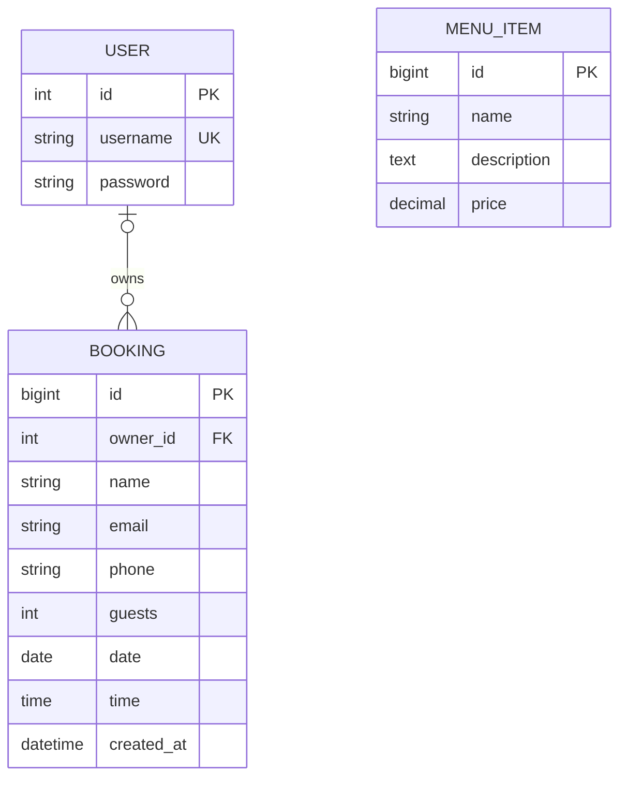

# Database Design

[Return to README](README.md)

## Entity Relationship Diagram

The diagram summarises the application's domain models. USER represents
Django's built-in user model; its other fields and supporting authentication
tables are omitted for clarity. The password field stores a password hash,
not a plaintext password.

## Relationships and ownership

A user can own zero or many bookings.

The database allows a booking to have no owner because records created before
authentication was introduced cannot safely be assigned to an account.
New customer bookings require authentication, and the view assigns the
signed-in user as the owner.

Customers can list, edit and delete only their own bookings. Unassigned
legacy bookings are excluded from customer lists and cannot be accessed
through customer edit or delete routes.

Staff must verify ownership before assigning a legacy booking. An email
address supplied on an old booking is not sufficient proof of ownership.

The owner relationship uses `on_delete=PROTECT`. Django therefore prevents
deleting a user while bookings still reference that user.

Menu items are independent of bookings. A booking reserves a visit and
does not select individual dishes, so there is no foreign key between
Booking and MenuItem.

## Booking fields

| Field | Definition | Validation or behaviour |
|---|---|---|
| id | Automatically generated primary key | Identifies the booking |
| owner | Nullable foreign key to Django User | Assigned by the server for new customer bookings |
| name | CharField, maximum 100 characters | Required by the booking form |
| email | EmailField | Required; email format validated |
| phone | CharField, maximum 20 characters | Required; phone-format validator applied |
| guests | IntegerField | Minimum 1, maximum 8 |
| date | DateField | Must not be in the past |
| time | TimeField | Must form a future datetime with the date |
| created_at | DateTimeField | Set automatically when the record is created |

Booking dates and times are interpreted in `Europe/Dublin`.

Bookings use 15-minute intervals. Accepted slots are 12:00–14:45 and
17:00–21:45. Closing times of 15:00 and 22:00 are excluded.
Elapsed times today, and a time equal to the current time, are rejected.

The same validation rules apply when creating and editing a booking.

## MenuItem fields

| Field | Definition |
|---|---|
| id | Automatically generated primary key |
| name | CharField, maximum 100 characters |
| description | TextField |
| price | DecimalField, maximum 6 digits including 2 decimal places |

Menu categories are derived from the existing name convention, such as
`Starters - Soup`, by the menu view. Category is not a separate model.

## Migrations

| Migration | Purpose |
|---|---|
| 0001_initial | Creates Booking and MenuItem |
| 0002_booking_owner_validation | Adds booking ownership and guest/phone validators |
| 0003_booking_guest_limit_eight | Changes the maximum online party size to 8 |

The ownership migration preserves existing records with a NULL owner.
It does not delete bookings or guess which user owns them.

## Validation boundaries

Booking ModelForms run model validation, including the shared date/time
rules. The application also restricts access in its views.

Django model `save()`, bulk operations and `QuerySet.update()` do not
automatically run `full_clean()`. Any future import or backend write
outside the validated forms must account for this.

Guest limits and future-date rules described here are application
validation rules, not database CHECK constraints.

The current system manages booking records. It does not implement
restaurant-wide seating capacity, overlapping-table allocation, payments
or automatic confirmation emails.