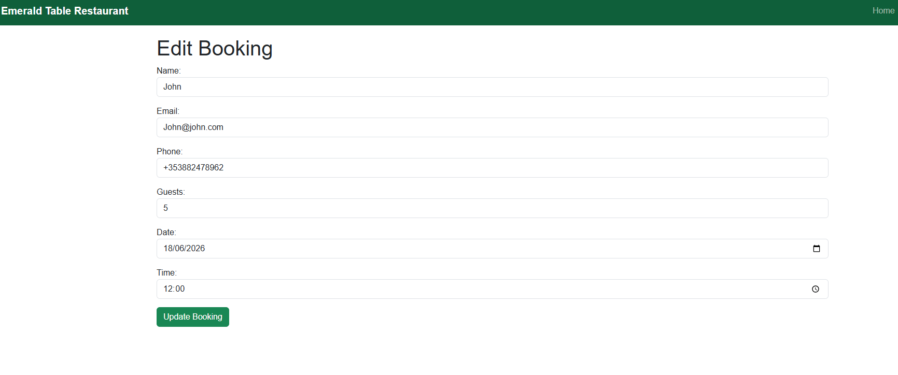
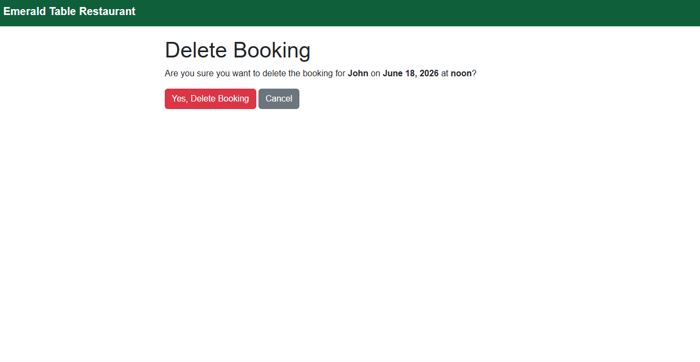

Following assessor feedback, the application was updated to address the identified issues:

## CRUD Functionality

The booking system now supports full CRUD operations:

- Create new bookings
- View existing bookings
- Edit existing bookings
- Delete existing bookings

This allows users to fully manage booking records through the frontend without requiring access to the Django admin panel.

## Security Improvements

The Django SECRET_KEY has been removed from the repository and is now stored securely using environment variables through a .env file. The .env file has been added to .gitignore to prevent sensitive information from being committed to version control.

## Testing Documentation

Testing documentation has been expanded to include:

- Manual feature testing
- CRUD functionality testing
- Form validation testing
- Expected and actual test results
- Supporting screenshots as evidence

  