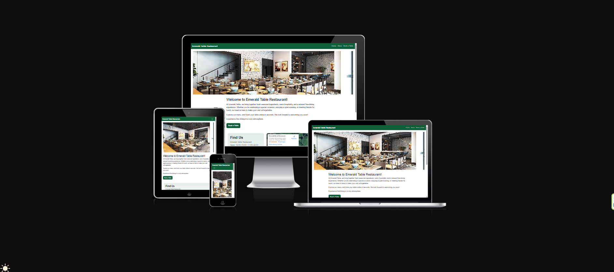
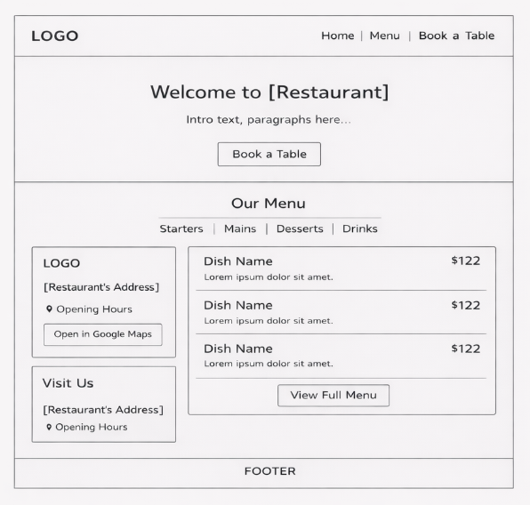
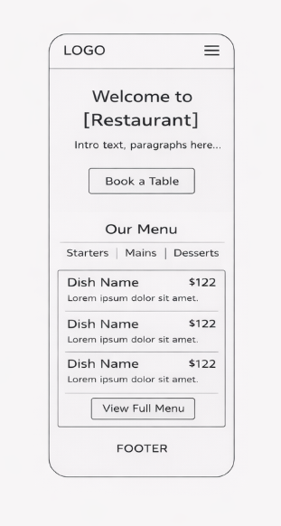
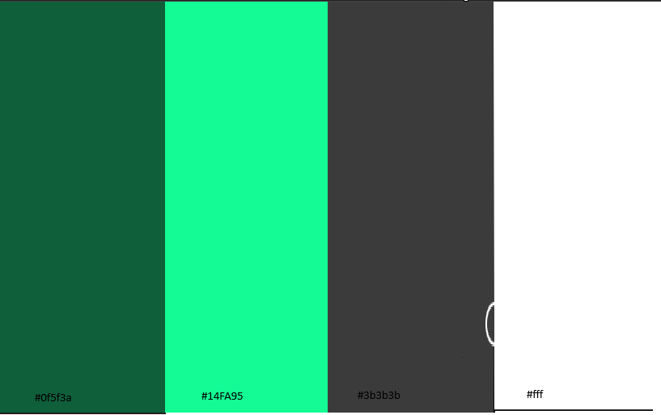
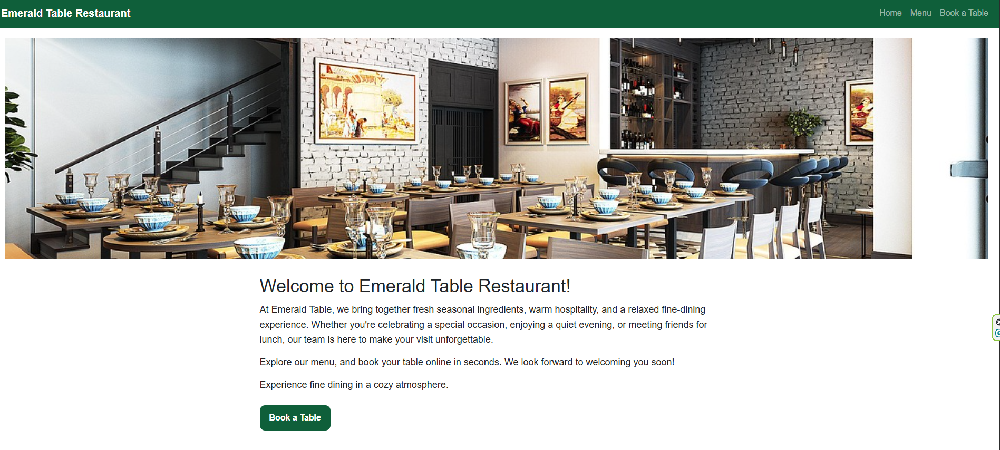
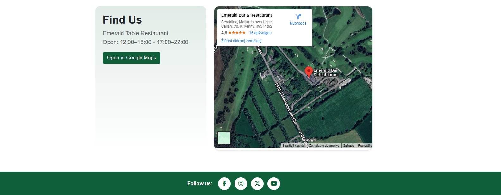
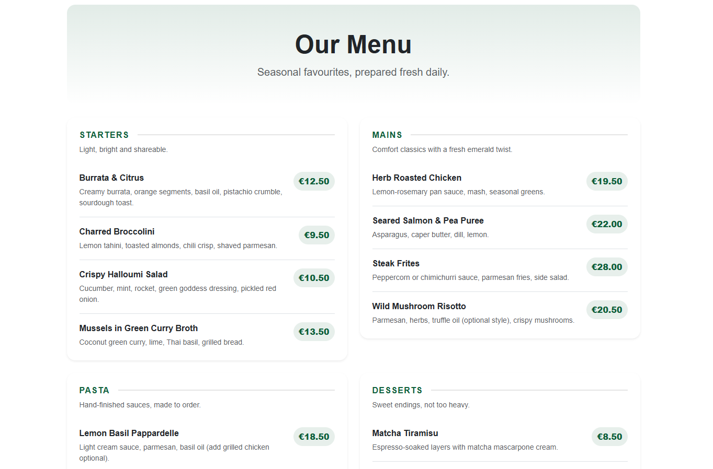
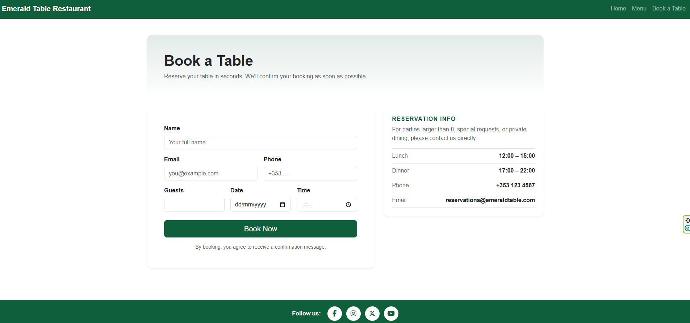
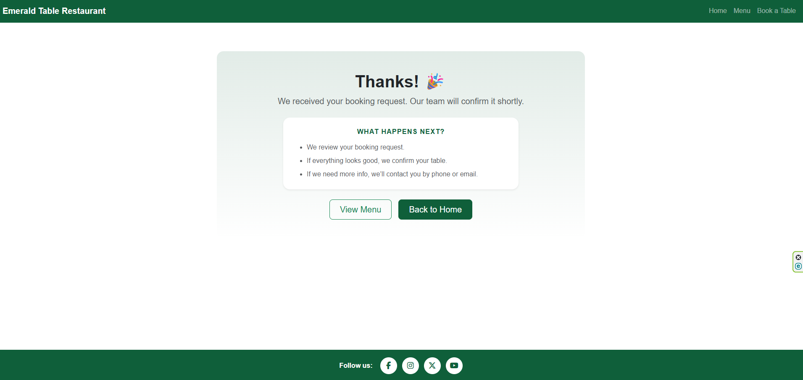
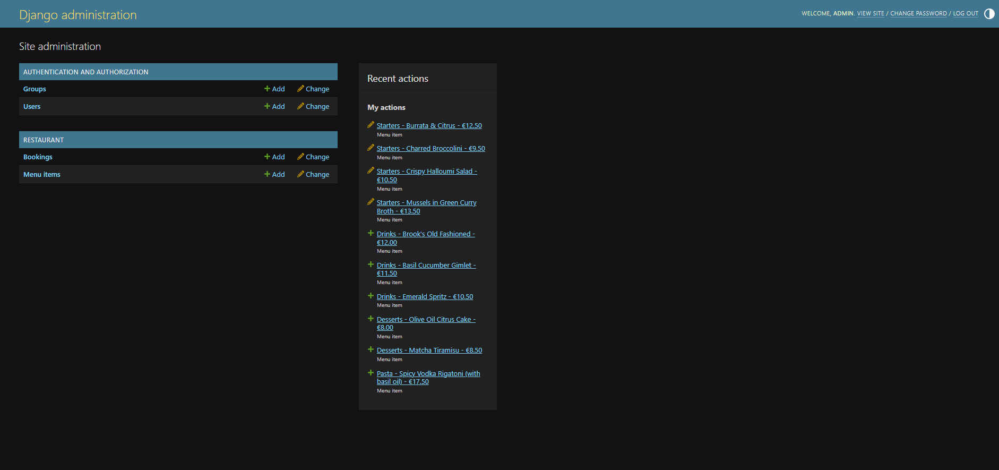

# Emerald Table Restaurant 🍽️




### A Django restaurant website for **Emerald Table Restaurant**.

A responsive restaurant website built with Django, featuring a homepage, menu display, account registration and an online booking system. Signed-in users can create, view, edit and delete their own bookings. Server-side validation checks guest numbers, booking dates and booking times.

The repaired application has been tested locally. Production deployment, exposed-secret remediation and the remaining assessment checks are still being verified. The live website may not yet contain the latest local repairs.

**Live Link:** [Emerald Table Restaurant](https://emerald-table-restaurant-8293c189fc58.herokuapp.com/)

## Database Design

See the [Entity Relationship Diagram and schema explanation](ERD.md)
for the user-to-booking relationship, field definitions, validation
rules and handling of legacy bookings.

## Features
- Modern homepage with hero image + Google Maps embed
- Menu page with dish layout (grouped into categories)
- Online booking form with opening-hours validation
- Booking success confirmation page
- Django admin panel for managing menu items and bookings
- Bootstrap 5 styling + emerald theme
- Production deployment setup with:

  - Gunicorn

  - WhiteNoise (static files)

  - Heroku-ready config

## Tech Stack

 - Backend: Django (Python)

- Frontend: HTML, CSS, Bootstrap 5

- Database: SQLite (development)

- Deployment: Heroku

- Static Files: WhiteNoise

- Version Control: Git + GitHub

## Wireframes




created with [Lucid](https://lucid.app/documents/#/home?folder_id=recent)

## Design & Colour Palette

The website uses an emerald green theme to reflect the restaurant’s identity: natural, fresh, elegant, and premium.

The palette is based around:

- Emerald Green — the primary brand colour used for headings, accents, buttons, and key UI elements

- Off-White / Light Backgrounds — used to keep the layout clean and readable

- Dark Text / Charcoal — for strong contrast and accessibility

- Light grey / bright green — used for hover effects and subtle highlights to give a luxury feel




# Pages Overview

## Homepage

The homepage introduces visitors to **Emerald Table Restaurant** with a modern hero section, strong branding, and a welcoming atmosphere. Users can quickly understand the restaurant’s concept and navigate to the menu or booking pages.

To improve the customer experience, the homepage also includes an embedded **Google Maps location**, allowing visitors to easily find the restaurant and plan their visit.





## Menu Page

The menu page displays dishes grouped by category for easy browsing.
Users can explore available meals, view pricing, and get a clear overview of the restaurant’s offerings.
All menu items are managed dynamically via the Django admin panel.



## Booking Page

The booking page allows customers to reserve a table through a user-friendly form.

- Features include:

  - Opening hours validation

  - Required field validation

  - Booking confirmation page

  - Edit Booking

  - Delete Booking

  - Backend storage of reservations

  - Reservations are stored in the database and can be managed through the Django admin interface.






## Getting Started (Local Setup)

These instructions are for a new local checkout on Windows using
PowerShell. The repaired application has been tested locally with
Python 3.13.14 and Django 6.0.8.

### 1. Clone the repository

```powershell
git clone https://github.com/darrio-dk08/emerald_table_restaurant.git
cd emerald_table_restaurant
```

Local repair commits may not yet be available on the remote repository
while security remediation and deployment checks are outstanding.

### 2. Create and activate a virtual environment

With Python 3.13 installed:

```powershell
py -3.13 -m venv .venv
.\.venv\Scripts\Activate.ps1
```

If PowerShell blocks activation, allow scripts for the current terminal
session and activate again:

```powershell
Set-ExecutionPolicy -Scope Process -ExecutionPolicy RemoteSigned
.\.venv\Scripts\Activate.ps1
```

### 3. Install dependencies

```powershell
python -m pip install -r requirements.txt
python -m pip check
```

Expected dependency-check result:

```text
No broken requirements found.
```

### 4. Configure local environment variables

Create a file named `.env` beside `manage.py`.

For a new installation, generate a development secret:

```powershell
python -c "from django.core.management.utils import get_random_secret_key; print(get_random_secret_key())"
```

Copy the generated value into `.env`:

```dotenv
SECRET_KEY=replace-with-your-generated-development-secret
DEBUG=True
ALLOWED_HOSTS=127.0.0.1,localhost
DATABASE_URL=
```

Replace the placeholder before running Django. Keep this development
secret private and use a different secret for production.

With `DEBUG=True` and an empty `DATABASE_URL`, the application uses
local SQLite. The configured timezone is `Europe/Dublin`.

Do not overwrite an existing `.env` without reviewing its configuration.
Do not commit `.env`, local databases or private backups.

### 5. Apply migrations and check the application

```powershell
python manage.py migrate
python manage.py check
python manage.py showmigrations restaurant
```

Expected Django check:

```text
System check identified no issues (0 silenced).
```

The restaurant migrations should show:

```text
restaurant
 [X] 0001_initial
 [X] 0002_booking_owner_validation
 [X] 0003_booking_guest_limit_eight
```

### 6. Create an administrator

```powershell
python manage.py createsuperuser
```

Follow the terminal prompts. A fresh database does not include the
existing development database's menu items or bookings.

### 7. Start the local server

```powershell
python manage.py runserver
```

Open http://127.0.0.1:8000/ in a browser.

The development-server warning is expected locally. Production must
use a production application server.

## Accounts and Bookings

- Register at `/accounts/signup/`.
- Sign in at `/accounts/login/`.
- Create a booking at `/booking/`.
- View your own bookings at `/bookings/`.
- Use the booking's Edit or Delete buttons to manage it.
- Deletion requires a confirmation POST.
- Logout uses a POST form with CSRF protection.

Online bookings accept 1–8 guests. Larger groups should contact the
restaurant directly.

Bookings require a future date and time in 15-minute intervals.
Available times are 12:00–14:45 and 17:00–21:45, using Europe/Dublin
local time.

Server-side validation applies to both booking creation and editing.
Submitting an unchanged edit displays an informational message rather
than claiming that the booking changed.

Legacy bookings may have no owner. They are excluded from ordinary
users' booking lists. Ownership must not be guessed or assigned to
an arbitrary account.

## Admin Panel

Visit `/admin/` and sign in with a staff account that has the necessary
permissions.

Menu items and bookings are registered with Django's administration
interface.

## Testing

See the [homepage HTML validation evidence](TESTING.md#homepage-html-validation--repaired-version).

See [TESTING.md](TESTING.md) for test coverage, manual results,
historical evidence and checks that remain pending.

Run the three verified automated test modules:

```powershell
python manage.py test restaurant.test_booking_security restaurant.test_accounts_and_times restaurant.test_page_links --verbosity 1
```

The recorded local result is 21 tests passing.

These tests cover booking validation, authentication, ownership
restrictions, CSRF protection, selected internal links, static asset
discovery and booking labels.

They do not establish that the deployed website, production database,
all accessibility requirements or Git history are secure.

## Deployment Status and Requirements

Heroku is the intended production platform. The live URL alone does
not establish which commit is deployed or whether it contains the
latest repairs.

Production verification remains pending. Before deployment:

- Back up existing production data and confirm the database in use.
- Rotate exposed secrets and complete the Git-history remediation.
- Confirm the Python runtime and pinned dependencies are compatible.
- Verify the Gunicorn process configuration.
- Configure `SECRET_KEY` with a new production-only secret.
- Set `DEBUG=False`.
- Set `ALLOWED_HOSTS` to the exact deployed hostname, without a URL scheme.
- Configure a persistent PostgreSQL database through `DATABASE_URL`.
- Apply all migrations to the production database.
- Verify static file collection and WhiteNoise asset serving.
- Run Django's deployment checks against production configuration.
- Verify HTTPS, authentication, ownership restrictions and CRUD on the live site.
- Record the deployed commit and compare it with the assessed source.

The repaired settings read configuration from environment variables.
Static storage uses Django's `STORAGES` setting.

Do not use the development SQLite database as the production database.
Do not mark deployment checks as passed until their results have been
recorded.

## Security Status

`.env`, the local SQLite database and Python cache files have been
removed from the current tracked files and added to ignore rules.

This does not remove their contents from earlier commits. Secret
rotation and Git-history cleanup remain outstanding.

## Bugs and Repair Notes

See [bugs.md](bugs.md) for the bug log and
[repair notes](PROJECT_IMPROVEMETS.md) for the repair summary.

## Credits

[Django Community](http://djangoproject.com/community)

[Stack Overflow](http://stackoverflow.com)

[The Code City](https://www.youtube.com/@TheCodeCity)

[Free Code Camp](https://www.youtube.com/@freecodecamp)

[Bootstrap Components](https://getbootstrap.com/docs/5.3/examples/)

[Project Ideas](https://data-flair.training/blogs/django-project-ideas/)

[Booking System](https://blog.devgenius.io/django-tutorial-on-how-to-create-a-booking-system-for-a-health-clinic-9b1920fc2b78)


### Heroku Live Deployment / Live Site Link:

[Emerald Table Restaurant](https://emerald-table-restaurant-8293c189fc58.herokuapp.com/)


### GitHub Source Code / GitHub Repository / Repo Link:

[E.T.R. GitHub Repo](https://github.com/darrio-dk08/emerald_table_restaurant)